# Peek-A-Geek

- Peek-A-Geek is a web-based platform for professionals, preciesely developers, to explore other developers' profile, their Github repositories and also communicate with them through posts.

- Our application is responsive, so you can open it in all kinds of devices.

## Dependencies

### Backend

- bcryptjs
- config
- express
- express-validator
- gravatar
- jsonwebtoken
- mongoose
- request

### Frontend

- axios
- react
- react-confirm-alert
- react-devtools
- react-dom
- react-moment
- react-redux
- react-router-dom
- react-script
- redux
- redux-devtools-extension
- redux-thunk
- uuid

## Dev Dependencies

- concurrently
- nodemon

## Installation

Run the command below in root directory and `client` directory to install dependencies

```
npm install
```

## Running the Application

Run the command below in root directory to run the app.

```
npm run dev
```

## Application Demo

<figure>
<figcaption>Homepage</figcaption>
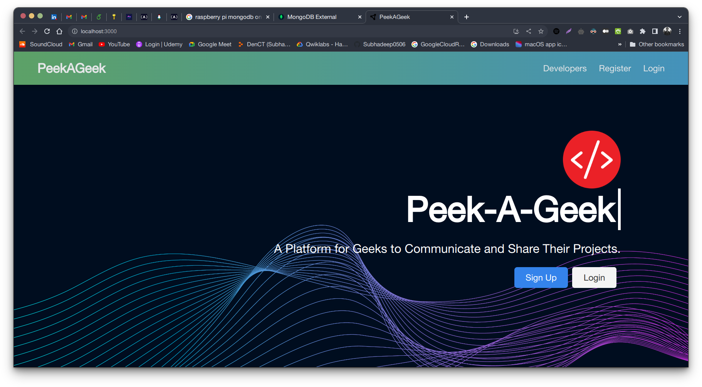
</figure>

<figure>
<figcaption>Signup Page</figcaption>
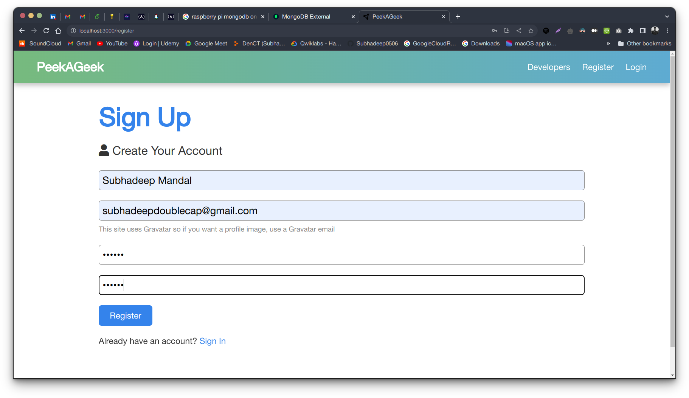
</figure>

<figure>
<figcaption>Signin Page</figcaption>
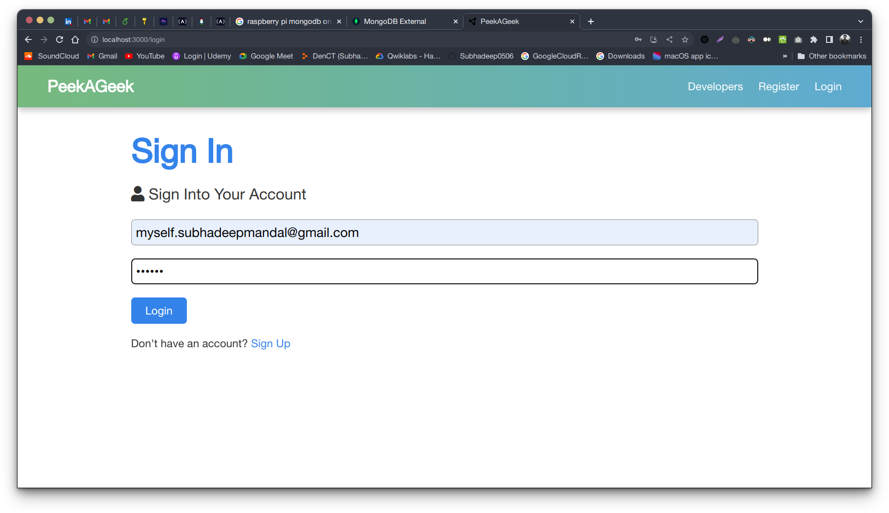
</figure>

<figure>
<figcaption>Dashboard for new Account</figcaption>
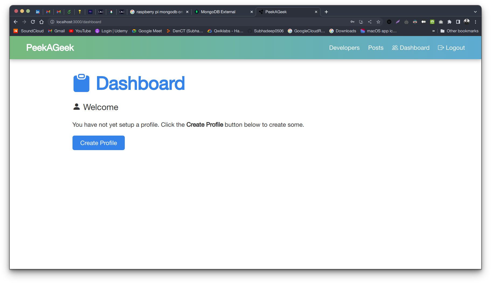
</figure>

<figure>
<figcaption>Dashboard before creating profile</figcaption>
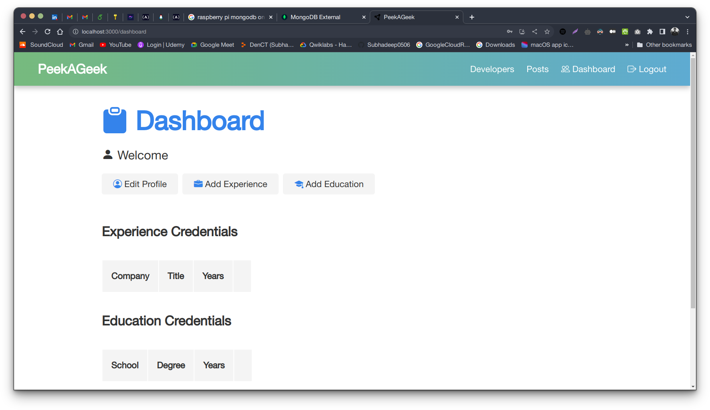
</figure>

<figure>
<figcaption>Dashboard after creating profile</figcaption>
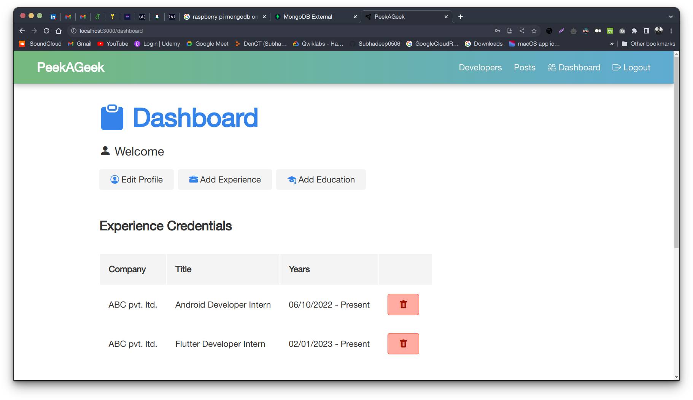
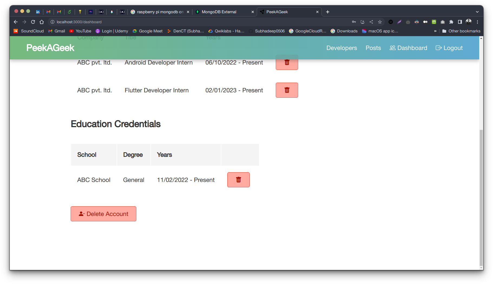
</figure>

<figure>
<figcaption>Delete experience confirmation popup</figcaption>
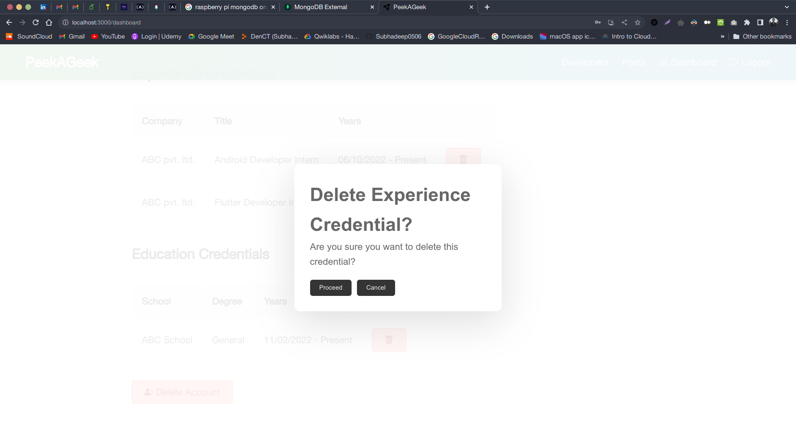
</figure>

<figure>
<figcaption>Posts Page</figcaption>
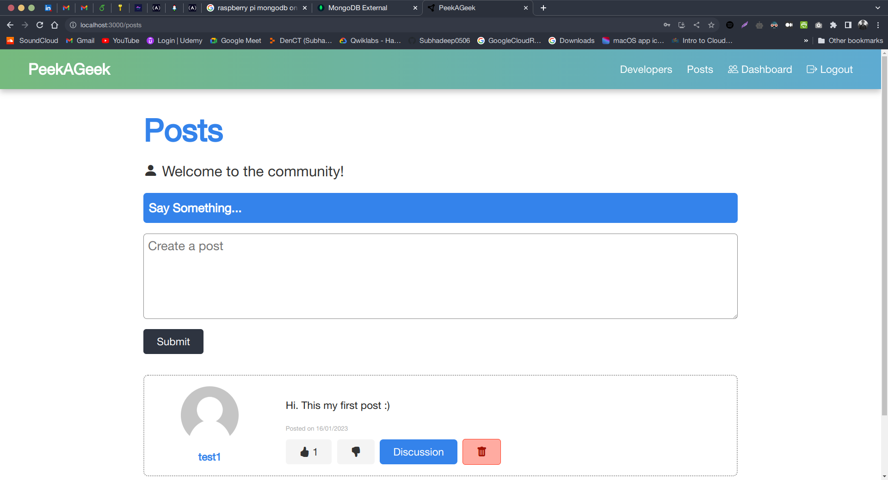
</figure>

<figure>
<figcaption>Developers Page</figcaption>
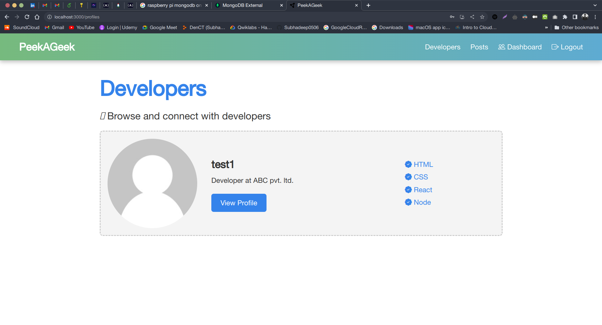
</figure>

<figure>
<figcaption>Developer profiles view</figcaption>
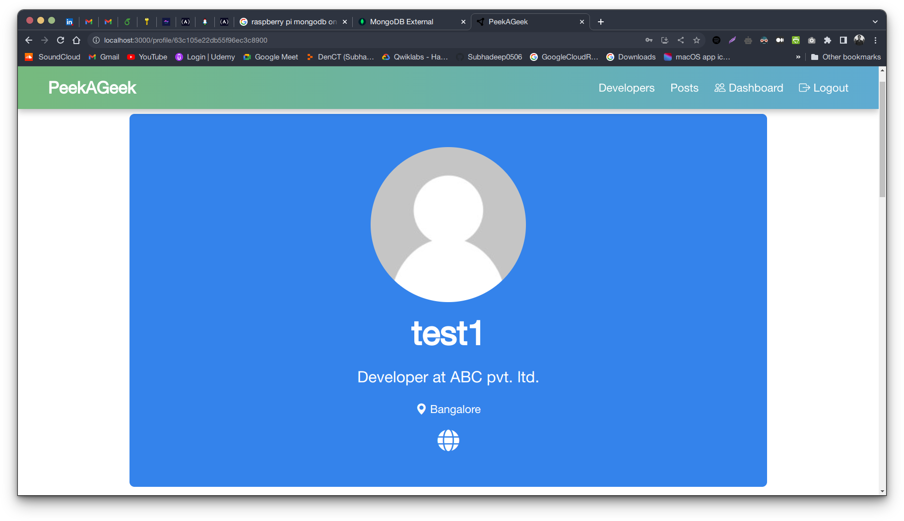
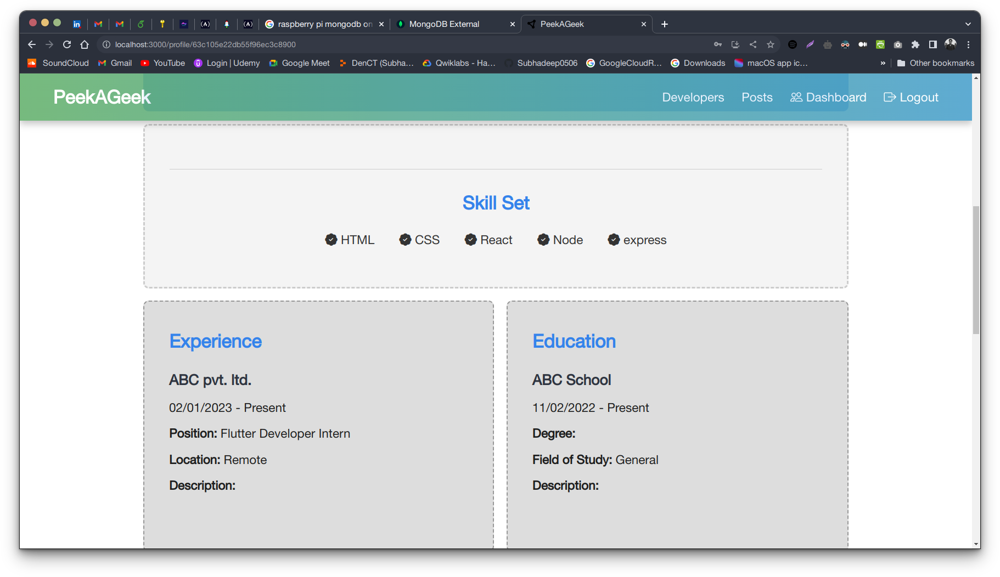
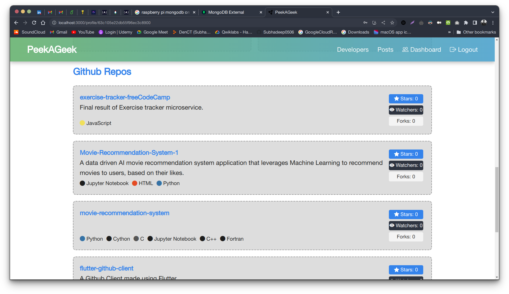
</figure>
